# redis

## Introduction redis

### What Redis

- Open source
- k/v cache and store
  - in-memory
  - 持久化
  - 主从(借助于sentinel实现一定意义上的HA)
  - Clustering(分布式)
- 多种数据结构
  - String,List, Hash, Set, Sorted Set, Bitmaps, Hyperloglogs
- 高性能，功能丰富
- 高可用分布式支持

### redis 的发展史

> Redis, Remote Directory Server 远程服务器字典

Salvatore Sanfilippo(Antirez)，意大利人，出生并居住在西西里岛，个人网站 http://invece.org/

早年系统管理员，关注计算机安全领域，于 1999年发明了idle scan 扫描技术，该技术现在 nmap 扫描器上也有实现。

2004-2006年期间在做嵌入式方面的工作，并为此写了名为 Jim 的 Tcl 解释器，《Tcl Wise: Guide to the Tcl programming language》一书以及《Tcl the Misunderstood》文档。（Redis 的时间处理器就重写自 Jim 的事件循环，而 Redis 的测试套件也使用 Tcl 语言来写的）。除此之外。他在 2006 还写了 Hping - 一个 TCP/IP 包分析器。

之后开始接触 web, 在 2007年和另一个朋友共同创建了 LLOOGG.com，并因为解决这个网站的负载问题而在 2009-02-26 发明了 Redis。

意大利创业公司，使用mysql性能问题，C语言编写
数据缓存在内存中，普通电脑一秒读取10万个键值对儿
问题：断电、程序关闭，数据丢失
解决：数据持久化

LLOOGG.com

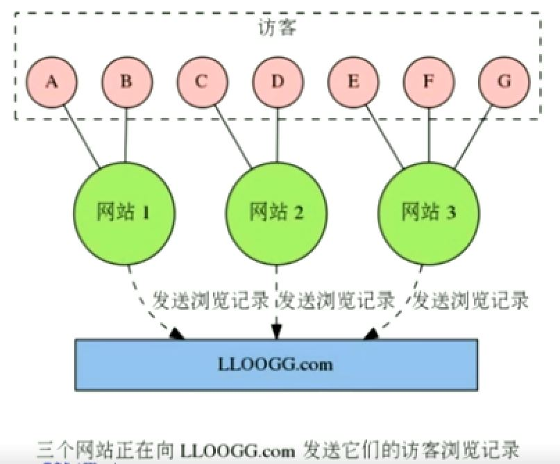

一个访客信息追踪网站，网站可以通过 JavaScript 脚本，将访客的 IP 地址、所属国家、阅读器信息、被访问页面的地址等数据传送给LLOOGG.com

然后 LLOOGG.com 会将这些浏览数据通过 web 页面实时地展示给用户，并存储起最新的5至10，000条浏览记录以便进行查阅。

Google Analytics 直到 2011 年才有了实时功能。LLOOGG.com的实时反馈(2007)实现

#### LLOOGG.com 运作方式-1

为了记录每个被追踪网站的浏览器信息，LLOOGG.com 需要为每个被追踪的网站创建一个列表（list）,每个list需要根据用户的设置，存储最新的5至10，000条浏览记录

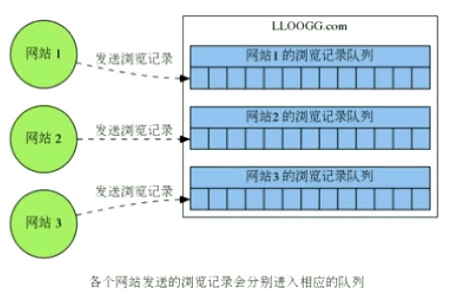

#### LLOOGG.com 运作方式-2

每当某个被追踪的网站新增一条浏览记录时，LLOOGG.com 就会将这条新的浏览记录推入(push)到与该网站相对应的列表里面，当列表的长度超过用户指定的最大长度时，程序每向列表推入一条新的记录，就需要从列表中弹出(pop)一条最旧的记录。

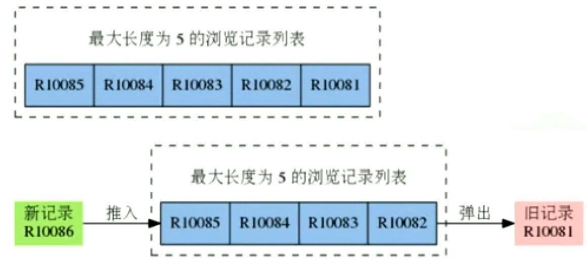

#### LLOOGG.com 的负载问题

随着用户越来越多，LLOOGG.com 要维护的列表量也越来越多，要执行的推入和弹出操作也会越来越多。

LLOOGG.com 当时使用 MySQL 数据库，而 MySQL 每次执行推入和弹出操作都要进行硬盘读写和读取，程序的性能严重受制于硬盘 I/O。

最终，LLOOGG.com 所使用的 MySQL 再也没办法在当时的 VPS(虚拟专用服务器) 上处理新增的大量负载。因为 LLOOGG.com 当时还没有找到盈利模式。所以为了尽量节约开支，antirez 没有直接升级 LLOOGG.com 所使用的 VPS, 而是打算另寻办法，在先有硬件的基础上，通过提升列表操作的性能来解决负载问题。

### Redis 诞生

为了不升级 VPS 的前提下，解决 LLOOGG.com 负载问题，antirez 决定自己写一个具有列表结构的内存数据库原型(prototype)

这个数据库原型支持 O(1) 复杂的推入和弹出操作，并且将数据存储在内存而不是硬盘，所以程序的性能不会到硬盘I/O限制，可以以极快的速度执行这对列表的推入和弹出操作。

经过实验，这个原型的确可以在不升级 VPS 前提下，解决 LLOOGG.com 当时的负载问题。

于是 antirez 使用 C 语言重写了这个内存数据库，并给他加上了持久化功能，Redis 就此当升！

### Redis 的演进

刚开始 / 现在

只支持列表结构 / 支持string、list、hash等六种结构，以及丰富的附加功能

只能单机运行，没有内置的方法可以方便地将数据库分不到多台机器上 / 支持多机运行（包括赋值、自动故障转移以及分布式数据库）

少有人知的开源项目 / 广为人知并广泛使用在很多大型网站的热门开源项目

接受捐款支持，antirez 自己无偿开发 / Pivotal 公司出资支持开发，并且有非常多的开发者通过 Github 和论坛为这个项目添砖加瓦

### Redis 特色

世界上有无数种数据库，为什么要选择使用 Redis?

- 速度快
- 持久化
- 多种数据结构
- 支持多种编程语言
- 功能丰富
- 简单
  - 代码
  - 使用
- 主从复制
- 高可用、分布式

#### 1. 键值对模型

- 很多数据库只能处理一种数据结构
  - SQL 数据库-表格
  - Memcached - 键值对儿数据库，键和值都是字符串
  - 文档数据库(CouchDB, MongoDB) - 由 JSON/BSON 组成的文档(document)

一旦数据库提供的数据结构不适合去做条件事的话，程序写起来就会非常麻烦和不自然。

Redis 也是键值对数据库，但和 Memcached 不同的是，Redis 的值不仅是字符串，他还可以其他五种数据结构中的任意一种。

通过选用不同的数据结构，用户可以使用 Redis 解决各式各样的问题。

键 -- 关联/映射--> 值 --> {字符串，列表，散列，集合，有序集合，HyperLogLog}

#### 2. 速度极快

Redis 将数据存储在内存里面，读写数据的都不会受到磁盘 I/O 速度的限制，所以速度极快。


**10W OPS**

- 数据存在哪 —— 内存
- 什么语言写 —— C语言（50000 line）
- 线程模型 —— 单线程

- Register(寄存器) ^ Fast Small Expensive
- L1 Cache
- L2 Cache
- Main Memory
- Local Disk(本地硬盘)
- Remote Disk(远程硬盘) v Slow Big Cheap


|类型|每秒读写次数|随机读写延迟|访问带宽|
|--|--|--|--|
|内存|千万级|80ns|5GB|
|SSD|35000|0.1-0.2ms|100-300MB|
|机械盘|100左右|100ms|100MB左右|

- 读速度：110000次/s
- 写速度：81000次/s

#### 3. 丰富的附加功能

- **持久化功能**（断电不丢失数据）：Redis 所有数据把保存在内存中的数据周期性的异步地保存到磁盘里面，保障数据安全，方便进行数据备份和恢复。
- **发布订阅功能**：将消息同时分发给多个客户端，用于构建广播系统
- **过期键功能**：为键设置一个过期时间，让它在指定的时间之后自动被删除
- **事务功能**：原子地执行多个操作，并提供乐观锁功能，保证处理数据时的安全性
- **Lua脚本功能**：在服务器端原子地执行多个操作，完成复杂的功能，并减少客户端与服务器之间的通信往返次数
- **复制**：为指定的 Redis 服务器创建一个或多个复制品，用于提升数据安全性，并分担读请求的负载
- **Sentinel**: 监控 Redis 服务器的状态，并在服务器发生故障时，进行自动故障转移
- **集群**：创建分布式数据库，每个服务器分别执行一部分写操作和读操作

#### 4. 多种数据结构

- 字符串：Strings
  - Blobs
  - 位图：Bitmaps
- 哈希：Hash Tables(objects)
- 列表：Linked Lists
- 集合：Sets
- 有序集合：Sorted Sets
- 地理信息定位：GEO
- HyperLogLog(2.8.19+): 超小内存唯一值计数(12K计算唯一值)

#### 5. 支持多种客户端语言

- Java
- PHP
- Python
- Ruby
- Lua
- NodeJS
- Go

#### 6. 简单

- C语言的 23.000 lines of code
- 不依赖外部库(like libevent)
- 单线程模型

#### 7. 主从复制

- 主服务器
  - 复制到从服务器
  - 复制到从服务器

#### 8. 高可用和分布式

- 高可用：Redis-Sentinel(v2.8) 支持高可用
- 分布式：Redis-Cluter(v3.0) 支持分布式

#### 9. 良好的支持

- antirez 非常勤奋，在每个版本都会不断地增加有用的新功能
  - 2.6 新增脚本功能，并为很多命令添加了多参数支持（比如 SADD、ZADD、等等）
  - 2.8 添加了数据库通知功能，HyperLogLog 数据结构以及 SCAN 命令，实现了部分重同步
  - 3.0 将推出了稳定版的 Redis 集群，另外还有更多新功能陆续开发中

Bug 一旦出现就会很快被修复，齐全的测试套件以及稳扎稳打的开发策略，使得 Redis 非常健壮可靠。

有问题时，在 Redis 的论坛上发帖，或者到 Redis 的 Github 页面发 issue，又或者直接和作者 antirez 联系，通常都可以很快得到回应。

Pivotal 公司雇佣 antirez 全力开发 Redis，无后顾之忧；这间公司也提供专门的 Redis 开发和维护咨询服务。

阿里云、百度云、Amazon、REdisLab 等公司都提供了给予 Redis 的应用服务

#### 10. 广泛的使用

Twitter 使用 Redis 来存储用户时间轴（User timeline）

StackOverflow 使用 Redis 来进行缓存和消息分发

Pinterest 使用 Redis 来构建关注模型(follow model)和兴趣图谱（interest graph）

Flickr 使用 Redis 来构建队列

Github 使用 REdis 作为持久化的键值对数据库，并使用 Resque 来实现消息队列

新浪微博使用 Redis 来实现计数器、反向索引、排行榜、消息队列、并存储用户关系

知乎使用 Redis 来进行计数、缓存、消息分发和任务调度

### Redis 典型应用场景

- 缓存系统
  - User ----访问----> App Server ——> **cache** ——> Storage
- 计数器
  - 转化数、评论数
- 消息队列系统
  - Producer -> 多个Messages(消息队列) <-> Consumer
- 排行榜
- 社交网络
- 实时系统

### redis优势

- 内建replication及cluster
- 就地更新（in-place update）操作
- 支持持久化
  - 避免雪崩效应
- Redis单线程，Memcached多线程

### mecached的优势

- 多线程
  - 善用多核CPU
  - 更少的阻塞操作
- 更少的内存开销
- 更少的内存分配压力
- 可能有更少的内存碎片

### 存储系统

- RDBMS: Oracle, DB2, PostgreSQL, MySQL, SQL Server
- NoSQL: Cassandra, HBase, Memcached, MongoDB, Redis
  - key-value NoSQL: Memcached, Redis, Tair
  - Column family NoSQL: Cassandra, HBase
  - Documentation NoSQL: MongoDB
  - Graph NoSQL: Neo4j
- NewSQL: Aerospike, FoundationDB, RethinkDB

### redis　应用
- Github
- Twitter
- stackoverflow
- 微博
- 知乎
- 阿里巴巴
- 百度
- 美团
- 搜狐
- Blizard
- flickr
- Pinterest
- Tumblr
- digg

### redis 版本

- 2015-4-1 Redis 3.0
  - redis Cluster
  - embedded string
  - LRU演算法的改进

### redis 下载安装配置并启动服务程序

[redis官网](http://redis.io/download)

#### 1. 下载

`# cd /usr/local/src && wget http://download.redis.io/releases/redis-3.2.10.tar.gz`

#### 2. 解压安装

``` shell
# tar xvf redis-3.2.10.tar.gz
# mv redis-3.2.10 /usr/local/redis/ 
# cd /usr/local/redis
# make && make install
```

#### 3. 可执行程序

- /usr/local/bin
  - redis-cli: Redis命令行客户端
  - redis-server: Redis服务器
  - redis-benchmark: Redis性能测试工具
  - redis-check-aof: AOF文件修复工具
    - Corrupted RDB
  - redis-check-dump: RDB文件检测工具
    - AOF files utilties
  - redis-sentinel: Sentinel 服务器（v2.8+）

#### 4. 安装目录下修改Redis配置文件redis.conf并安装复制到/etc/目录下 

```sh
# cp /usr/local/redis/reids.conf /etc/redis/
# vi /etc/redis/redis.conf
 bind 127.0.0.1 #绑定IP地址
 port 6379 #对外端口
 daemonize yes #以守护进程的方式使用
 dbfilename dump.rdb #数据文件
 dir /var/lib/redis #数据文件存储目录（持久化）
 logfile /var/log/redis/redis-server.log #系统日志文件
 database 16 #数据库默认有16个
 slaveof #主从赋值，类似于双击备份

> config get *

# cat redis.conf | grep -v "#" | grep -v "^$" > redis-6382.conf
# vim redis-6382.conf
  daemonize yes 是否是守护进程
  port 6382 对外端口
  dir "/data/redis/data" 工作目录
  logfile "6382.log" 系统日志

# cp redis.conf /etc/
```

Merz: 6379

####　5. 启动服务-指定配置文件

``` shell
简单启动redis
# redis-server 

验证
# ps -ef | grep redis
# netstat -antpl | grep redis
# redis-cli -h ip -p port ping

动态参数启动
# redis-server --port 6380

配置启动
# redis-server /etc/redis.conf

service命令启动
# service redis start

生产环境选择配置启动

单机多实例配置文件可以用端口分开

```

####　6. Redis客户端连接服务器

```bash
# redis-cli
# redis-cli -h IP
>help append
>help @string
>help @server
>client list
ping
```

#### 8. redis客户端返回值

```sh
状态回复：10.10.10.10:6304> ping
错误回：10.10.10.10:6304> hget hello field
  (error)...
整数回：10.10.10.10:6404> incr hello
  (integer) 1
字符串回复：10.10.10.10:6304> get hello
  "world"
多行字符串回：10.10.10.10:6304> get hello
  1) "world"
  2) "bar"
```

#### 7. 停止服务redis

- 客户端连接服务后: `> shutdown`
- 关闭进程: `# killall redis-server`

关闭服务
```sh
# ps aux | grep redis
# kill -9 redis有关进程号
```

- 启动服务

```sh
# redis-server /etc/redis/redis.conf pwd
```

#### 8. Redis守护进程

- 监听端口：`6379/tcp`
- backlog（等待队列）
- bind 127.0.0.1 172.16.100.6 监听地址

- 同一主机建议：
  - unixsocket /tmp/redis.sock
  - unixsocketperm 700
- timeout 0 超时功能
- loglevel notice
- logfile
- database 16：默认使用一个数据库，这里可使用16个数据库
  - 集群只能使用一个

save 300 10 ： 300秒内发生10个记录修改，生成快照

## Redis API

### 通用命令
```
打开数据库
> select 1

遍历所有键
> keys *

> mset hello world hi haha php good
> keys he*
> keys he[k-z]*
> keys ph?

计算键的总数
>dbsize 
>sadd myset a b c d ef

是否存在age键名:返回 0 | 1
>exists key age

删除指定key-value
> del key age

设置过期时间
>expire key seconds

查看key剩余过期时间
> ttl key

去掉key的过期时间
> persis key

查看数据类型
> type key
-2 表示key已经不存在了

> persis hello
> ttl hello
-1 表示key存在，并且没有过期时间
```

`keys` 命令一般不再生产环境使用

- 时间复杂度
  - keys : O(n)
  - dbsize : O(1)
  - del : O(1)
  - exists : O(1)
  - expire : O(1)
  - type : O(1)

### 数据结构

> redis 是key-value的数据，所有每个数据都是一个键值对

- 键的类型是字符串
- 值的类型分为五种
  - 字符串 string
  - 哈希 hash
  - 列表 list
  - 集合 set
  - 有序集合 zset

#### 数据结构与内部编码

- key
  - string(数据结构)
    - raw(内部编码)
	- int
	- embstr
  - hash
    - hashtable
	- ziplist
  - list
    - linkedlist
	- ziplist
  - set
    - hashtable
	- intset
  - zset
    - skiplist
	- ziplist

#### redisObject

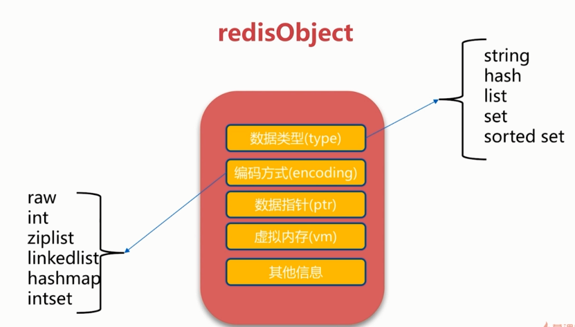

#### sring 字符窜类型

> key value

- value最大能存储**512MB**数据
- string 类型是二进制安全的，既可以为任何数据，比如数字、文字、图片、序列化对象等

- 场景
  - 缓存
  - 计数器
  - 分布式锁

- 设置键值: O(1)
  - `set key value`
  - `seconds`: 过期时间，以秒为单位。没有过期时间就永久存储
  - `setex key seconds value`
- 设置多个值
  - `mset key value [key value ...]` **O(n)**
- 获取值: O(1) 
  - `get key` 没有：(nil)
  - `mget key1 key2` 批量获取key，原子操作， **O(n)**

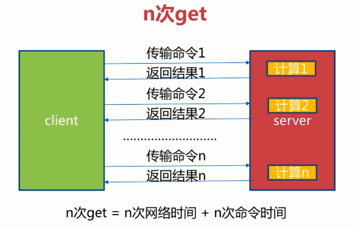
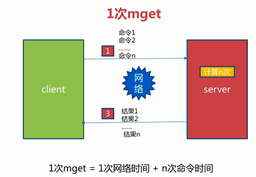

- 删除键： O(1)
  - `del key`
- 运算
	+ 值是数字
	+ 将 key 对应的 value 加1

	+ `incr key` #key自增1，如果key不存在，自增后get(key)=1, O(1)
	+ `decr key` #key自减1，如果key不存在，自减后get(key)=k, O(1)
	+ `incrby key k` #key自增k，如果key不存在，自增后get(key)=k, O(1)
	+ `decrby key k`

- 其他
  - `getset key newvalue` #set key newvalue并且返回旧的value **O(1)**
	- `append key value` #将value追加到就得value **O(1)**
	- `strlen key` #返回字符长度（注意中文）**O(1)** 中文两个字节
	- `incrbyfloat key 3.3` #增加key对应的值3.5, **O(1)**
  - `getrange key start end` #获取字符串指定下标所有的值**O(1)**
  - `setrange key index value` #设置指定下标所有对应的值**O(1)**

```
incr counter
incrbyfloat counter 1.1
2.1
get counter
"2.1"
set hello javabest
getrange hello 0 2
"jav"
setrange hello 4 p
8
get hello
javapest
```

- 键的命令 **O(1)**
	+ `keys *` 所有的键盘
	+ `keys '*1*'` 包含1的键名
	+ `exists key [key ...]` 是否存在，存在返回1，否则返回0
	+ 查看对应的 value 的类型
		* `type key`
	+ 删除键及对应的值
		* `del key [key ...]`
	+ 设置过期时间，以秒为单位
		* `expires key seconds`
		* 创建时没有设置过期时间，则一直存在，直到使用del 移除
	+ 查看有效时间
		* `ttl key`

- 记录网站每个用户个人主页的访问量？
  - incr userid:pageview(单线程：无竞争)

- 缓存视频的基本信息（数据源在MySQL中）伪代码

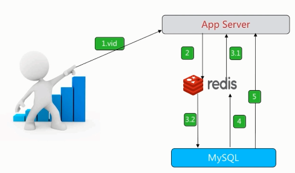

```
public VideoInfo get(long id) {
	String redisKey = redisPrefix + id;
	VideoInfo videoInfo = redis.get(redisKey);
	if (videoInfo == null) {
		videoInfo = mysql.get(id);
		if (videoInfo != null) {
			// 序列化
			redis.set(redisKey, serialize(videoInfo));
		}
	}
	return videoInfo;
}
```


`incr id`(原子操作)

- `set key vlaue` #不管key是否存在，都设置
- `setnx key value` #key不存在，才设置
- `set key value xx` #key存在，才设置

#### hash 哈希类型

> 用于存储对象，对象的格式为键值对
{name:'cg',age:20}

- 设置
	+ 设置单个属性
		* hset key field value
		* hset data name "零壹码"
		* hset data age 20
		* type data // hash


	+ 设置多个属性
		* hmset key field value [field value ...]
- 获取
	+ 获取一个属性的值
		* hget key field
		* hget name name 

	+ 获取多个属性的值
		* hmget key field [field ...]

	+ 获取所有的属性和值
		* hgetall key

	+ 获取所有的属性
		* hkeys key

	+ 返回包含属性的个数
		* hlen key

	+ 获取所有值
		* hvals key
- 其他
	+ 判断属性是否存在
		* hexists key field
	+ 删除属性及值
		* hdel key field [field ...]
	+ 返回值的字符串长度
		* hstrlen key field 	

- `hset key field value` 设置hash key对应的field的value **O(1)**
- `hsetnx`
- `hget key filed` 获取hash key对应的field的value, **O(1)**
- `hkeys`
- hvals
- `hdel key field` 删除hash key对应field的value **O(1)**
- `hexists key field` 判断hash key是否有field **O(1)**
- `hlen key` 获取hash key field的数量 **O(1)**
- `hmget key field1 filed2... fieldN` 批量获取hash key的一批field对应的值 **O(n)**
- `hmset field1 value1 field2 value2 fieldN valueN` 批量设置 hash key的一批 field value

- `hgetall key` 返回hash key对应所有的field和value **O(n)**
- `hvals key` 返回hash key对应所有field的value **O(n)**
- `hkeys key` 返回hash key对应所有field **O(n)**
```
hset user:1:info age 23
hget user:1:info age
23
hset user:1:info name ronaldo
hgetall user:1:info
"age"
"23"
"name"
"ronaldo"
hdel user:1:info age

hexists user:1:info name
1
hlen user:1:info
2

小心使用hgetall(牢记单线程)
hgetall user:2:info
hvals user:2:info
hkeys user:2:info
```

记录网路每个用户个人主页的访问量？

```
hincrby user:1:info pageview count
```

缓存视频的基本信息（数据源在MySQL中）伪代码

```
public VideoInfo get(long id) {
	String redisKey = redisPrefix + id;
	Map<String,String> hashMap = redis.hgetAll(redisKey);
	VideoInfo videoInfo = transferMapToVideo(hashMap);
	if(videoInfo == null) {
		videoInfo = mysql.get(id);
		if (video != null) {
			redis.hmset(redisKey, transferVideoToMap(videoInfo));
		}
	}
	return videoInfo;
}
```


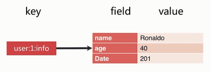

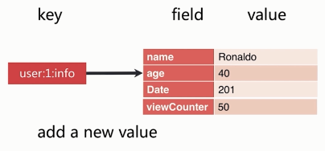

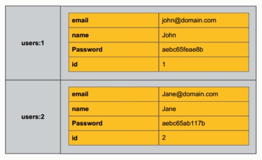

Mapmap?

Small redis

field 不能相同，value可以相同


#### string VS hash

- get | hget
- set setnx | hset hsetnx
- del | hdel
- incr incrby decr decrby | hincrby
- mset | hmset
- mget | hmget

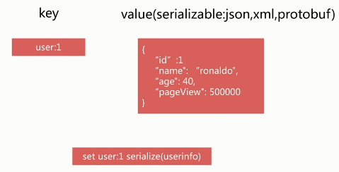

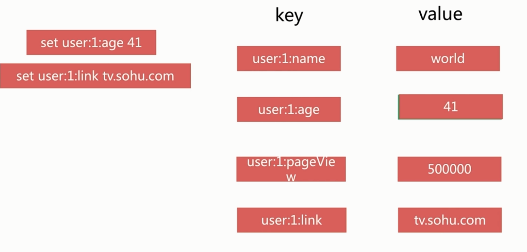

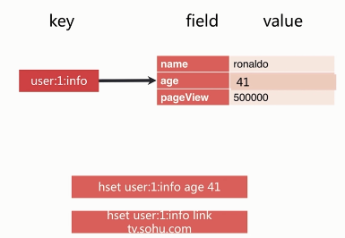

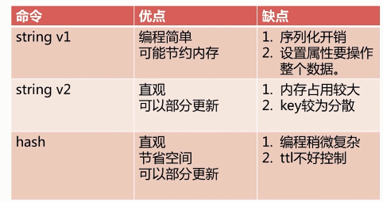


#### list 列表类型

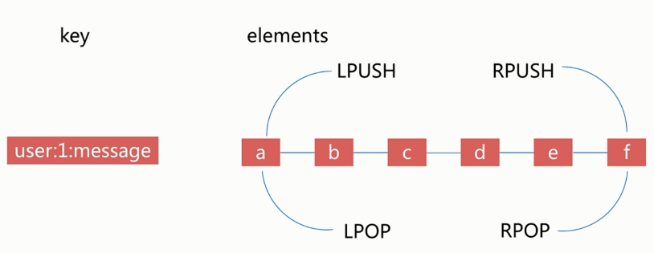

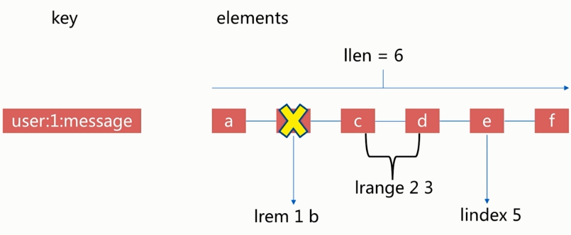

- 列表的元素类型为string
- 按照插入顺序排序
- 左右两边插入弹出
  - 在列表的头部或者尾部添加或删除元素
- 有序
- 可以重复

- api
  - rpush
    - `rpush key value1 value2 ... valueN`
	  - 从列表右端插入值(1-N个)
	  - O(1~n)
	  - `rpush likekey c b a`
  - lpush
	- `lpush key value1 value2 ... valueN`	 
  - linsert
    - `linsert key before | after value new Value`
	  - 在list指定的值前|后插入newValue
      - O(n)
	  - a - b - c - d
	    - linsert listkey before b java
	      - a - java - b - c - d
		- linsert listkey after b php
		  - a - b - php - c - d
  - lpop
    - `lpop key`	
	  - 从列表左侧弹出一个item
	    - o(1)
	- `rpop key`
  - lrem
    - `lrem key count value`
	  - 根据count值，从列表中删除所有value相等的项
	    - 1.count>0, 从左到右，删除最多count个value相等的项
		- 2.count<0, 从右到左，删除最多Math.abs(count)个value相等的项
		- 3.count=0, 删除所有value相等的项
	  - a c a c b f
	    - `lrem listkey 0 a`
		  - c c b f
		    - `lrem listkey -1 c`
		      - c b f
  - ltrim
    - ltrim key start end
	  - 按照索引范围修剪列表
	  - O(n)
	  - a b c d e f
	    - ltrim listkey 1 4
		  -  b c d e
		    - ltrim listkey 0 2
		      - b c d
  - lrange
    - `lrange key start end` (包含end)
	  - 获取列表指定索引范围所有item
	  - O(n)
	  - a b c d e f
	    - 索引从左：0~5
		- 索引从左：-1~-6
		- lrange listkey 0 2
		  - a b c
		- lrange listkey 1 -1
		  - b c d e f
  - lindex
    - lindex key index
	  - 获取列表指定索引的item
	  - a b c d e f
	    - `lindex listkey 0` => a
		- `lindex listkey -1` => f
  - llen
    - llen key
	  - 获取列表长度
	  - O(1)
	  - a b c d e f 
      - `llen listkey` => 6
  - lset
    - `lset key index newValue`
	  - 设置列表指定索引值为 newValue
	  - O(n)
	  - a b c d e f
	    - lset listkey 2 java
	      - a b java d e f

```
rpush mylist a b c
lrange listkey 0 -1
lpush listkey 0
lrange listkey 0 -1
rpop listkey
lrange listkey 0 -1
```

- blpop/brpop key timeout
  - lpop/rpop阻塞版本，timeout是阻塞超时时间，timeout=0为永远不阻塞
  - O(1)

- tips
  - lpush + lpop = stack
  - lpush + rpop = queue
  - lpush + ltrim = Capped Collection 固定数量列表
  - lpush + brpop = Message Queue 消息队列

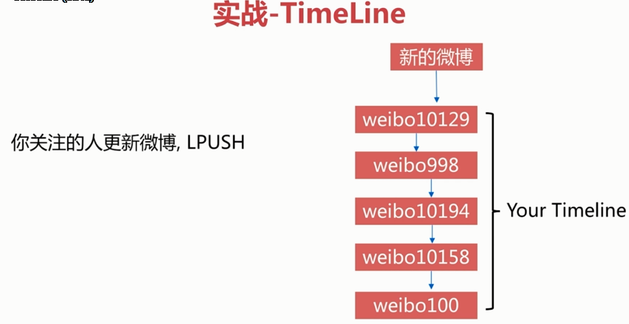

- 设置
	+ 在头部插入数据
		* lpush key value [value ...]
	+ 在尾部插入数据
		* rpush key value [value ...]

	+ 在一个元素的前后插入新元素
		* linsert key before|after pivoid value

	+ 设置指定索引的元素值
	+ 索引是基于0的下标
	+ 索引可以是负数，表示偏移量是从 list 尾部开始计算。

		* lset key index value

- 获取
	+ 移除并且返回 key 对应的 list　的第一个元素
		* lpop key

	+ 移除并返回存于 key 的 list 的最后一个元素
		* rpop key

```
help set
`set key value [EX seconds] [NX|XX]`
`SET disto fedora` 设置
`GET disto` 获取
`APPEND disto centos` 追加
`strlen disto` 字符大小
`SET count 0`
`incr count` 自增
`decr count` 自减
`SETNX disto gentoo NX` nx不存在时设置
`SETNX bar gentoo XX` xx存在时设置
`SETNX count 0`
`exists count`
```

#### lists

- lpush
- rpush
- lpop
- rpop
- lindex
- lset

#### sets 集合类型
- sadd
- sinter
- sunion
- spop
- sismeb

#### Sorted sets 有序集合类型

- zadd
- zrange
- zcard
- zrank

#### bit

> 位图

字符串big对应的二进制

b(98)---------i----------g

01100010 01101001 01100111

```
set hello big
getbit hello 0 获取第一位位图值 0
getbit hello 1 获取第一位位图值 1
setbit hello 7 1
(integer) 0
get hello
"cig"
```


```
setbit key off value #给位图指定索引设置值

> setbit unique:users:2016-04-05 0 1
(integer) 0
> setbit unique:users:2016-04-05 5 1
(integer) 0
> setbit unique:users:2016-04-05 11 1
(integer) 0
> setbit unique:users:2016-04-05 15 1
(integer) 0
> setbit unique:users:2016-04-05 19 1

10000 1 00 00 0 1 0   0  0  1  0  0  0  1
01234 5 67 8910 11 12 13 14 15 16 17 18 19

getbit key offset #获取位图指定索引的值
>getbit unique:users:2016-04-05 8
(integer) 0
>getbit unique:users:2016-04-05 19
(integer) 1

bitcount key [start end]
# 获取位图指定范围（start到end），单位为字节，如果不指定就是获取全部）位值为1的个数

>bitcount unique:users:2016-04-06
(integer) 5 #有5个唯一的1
>bitcount unique:users:2016-04-05 1 3
(integer) 3 #第一个字节到第三个字节间的唯一的1

bitop
bitop op destkey key [key...]
做多个Bitmap的and(交集)，or(并集), not(非), xor(异或)
操作并将结果保存在destkey中

#求两个位图的并集
>bitop and unique:users:and:2016_04_04-2016_04_05 unique:users:2016-04-05 unique:users:2016-04-04
(integer) 3
> bitcount unique:users:and:2016_04_04-2016_04_05
(integer) 2

bitpos
bitpos key targetBit [start] [end]
计算位图指定范围(start到end, 单位为字节，如果不指定就是获取全部)第一个偏移量对应的值等于targetBit的位置

> bitpos unique:users:2016-04-04 1
(integer) 1
> bitpos unique:users:2016-04-04 0 1 2
(integer) 8
```

#### 独立用户统计

1. 使用 set 和 Bitmap
2. 1亿用户，5千万独立

| 数据类型 | 每个userid占用空间 | 需要存储的用户量 | 全部内存量 |
| -- | -- | --| -- |
| set | 32位(4byte, 假设userid用的是整型，实际很多网站用的是长整型) | 50,000,000 | 32位 * 50,000,000=200MB  |
| Bitmap | 1位 | 100,000,000 | 1位 * 100,000,000=12.5MB  |

userid:10000, 给索引10000位置加上1

| | 1天 | 1个月 | 1年 |
| -- | -- | --| -- |
| set | 200M | 6G | 72G  |
| Bitmap | 12.5M | 375M | 4.5G  |


#### 只有10完独立用户

| 数据类型 | 每个userid占用空间 | 需要存储的用户量 | 全部内存量 |
| -- | -- | --| -- |
| set | 32位(4byte, 假设userid用的是整型，实际很多网站用的是长整型) | 1,000,000 | 32位 * 1,000,000=4MB  |
| Bitmap | 1位 | 100,000,000 | 1位 * 100,000,000=12.5MB  |

#### 使用经验

1. Bitmap的type=string, 最大512MB
2. 注意setbit时的偏移量，可能有较大耗时
3. 位图不是绝对好


#### HyperLogLog

> 基于HyperLogLog算法：极小空间完成独立数量统计；本质还是字符串


```
> type hyperloglog_key
string
```

- 三个命令

1. `pfadd key element [element ...]` : 向hyperloglog添加元素
2. `pfcount key [key ...]` : 计算hyperloglog的独立总数
3. `pfmerge destkey sourcekey [sourcekey ...]` : 合并多个hyperloglog


独立id统计
```
redis> pfadd 2017_03_06:unique:ids "uuid-1" "uuid-2" "uuid-3" "uuid-4"
(integer) 1

# 独立用户统计
redis> pfcount 2017_03_06:unique:ids
(integer) 4

# 添加uuid
redis> pfadd 2017_03_06:unique:ids "uuid-1" "uuid-2" "uuid-3" "uuid-90"
(integer)1
redis> pfcount 2017_03_06:unique:ids
(integer) 5


redis> pfadd 2017_03_06:unique:ids "uuid-1" "uuid-2" "uuid-3" "uuid-4"
(integer) 1
redis> pfcount 2016_03_06:unique:ids
(integer) 4
redis> pfadd 2016_03_05:unique:ids "uuid-4" "uuid-5" "uuid-6" "uuid-7"
(integer) 1
redis> pfcount 2016_03_05:unique:ids
(integer) 4
redis> pfmerge 2016_03_05_06:unique:ids 2016_03_05:unique:ids 2016_03_06:unique:ids
OK
redis> pfcount 2016_03_05_06:unique:ids
```

#### 内存消耗（百万独立用户）

```
elements=""
key="2016_05_01:unique:ids"
for i in `seq 1 1000000`
do
  elements="${elements} uuid-"${i}
  if [[ $((i%1000)) == 0 ]]
  then
    redis-cli pfadd ${key} ${elements}
	elements=""
  fi
done
```

- 内存消耗
  - 1天：15KB
  - 一个月：450KB
  - 1年：15KB*365=5MB

#### 使用经验

1. 是否容忍错误（错误率：0.81%）

- 取不到具体用户
```
pfcount 2016_05_01:unique:ids(integer)
10009838
```

2. 是否需要单条数据

#### GEO

> 地理信息定位，存储经纬度，计算两地距离，范围计算等

redis-3.2+支持

- 北京：116.29(经度), 39.55
- 天津：117.12, 39.08

- 5个城市的经纬度

|城市|经度|纬度|简称|
|--|--|--|--|
|北京|116.28|39.55|bejing|
|天津|117.12|39.08|tianjin|
|石家庄|114.29|39.02|shijiazhuang|
|唐山|118.01|39.38|tangshan|
|保定|115.29|38.51|baoding|

```
geo key longitude latitude member
[longitude latitude member ...]
#增加地理位置信息

> geoadd cities:locations 116.28 39.55 bejing
(integer) 1
> geoadd cities:locations 116.28 39.55 bejing
(integer) 1
> geoadd cities:locations 117.12 39.08 tianjin
114.29 38.02 shijiazhuang 118.01 39.38 tangshang 115.29 38.51 baoding
(integer) 4

geoops key member [member ...]
#后去地理位置信息
> geopos cities:locations tianjin
1) 1) "117.12000042200088501"
   2) "39.0800000535766543"


geodist key member1 member2 [unit]
#获取两个地理位置的距离
#unit: m(米) km(千米), mi(英里), ft(尺)

> geodist cities:locations tianjin beijing km
天津和北京的公里数
"89.2061"

georadius 获取指定范围内的用户数量
georadius key longtitude latitude radiusm|km|ft|mi [withcoord] [withdist] [withhash] [COUNT count] [asc|desc] [store key] [storedist key]


georadiusbymember key member radiusm|km|ft|mi [withcoord] [withdist] [withhash] [COUNT count] [asc|desc] [store key] [storedist key]
# 获取指定位置范围内的地理位置信息集合

withcoord: 返回结果中包含经纬度
withdis: 返回结果中包含距离市中心节点位置
withhash: 返回结果中包含geohash
COUNT count: 指定范围结果的数量
asc|desc: 返回结果按照距离中心节点的距离做生序或者降序
store key: 将返回结果的地理位置信息保存到指定键
storedist key: 将返回结果距离中心节点的距离保存到指定键
```

距离北京150公里内的城市
```
> georadiusbymember cities:locations beijing 150km
1) "beijing"
2) "tianjin"
3) "tangshang"
4) "baoding"
```

1. since 3.2+
2. type geokey=zset
3. 没有删除API: `zrem key member`


[分布式缓存redis](http://blog.oldboyedu.com/ops-cache/)

## 单线程


1. 一次只运行一条命令
2. 拒绝长（慢）命令 - keys, flushall, flushdb, slow lua script, mutil/exec, operate big value(collection)
3. 其实不是单线程
  - fysnc file descriptor
  - close file descriptor


## 慢查询

### 声明周期

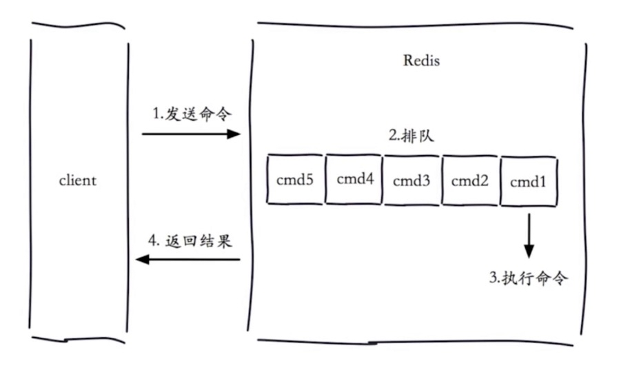

1. 在执行命令的时候会产生慢查询
2. 客户端超时不一定慢查询，但慢查询是客户端超时的一个可能因素（4个步骤都有能超时）

### 两个配置

- slowlog-max-len
  - 1. 先进先出队列
  - 2. 固定长度
  - 3. 保存在内存内

- slowlog-log-slower-than
  - 1. 慢查询阀值（单位：微妙）
  - 2. slowlog-log-slower-than=0，纪录所有命令
  - 3. slowlog-log-slower-than<0，不纪录任何命令

- 配置方法
  - 1. 默认值
    - config get slowlog-max-len = 128
	- config get slowlog-log-slower-than = 10000
  - 2. 修改配置文件重启
  - 3. 动态配置
    - config set slowlog-max-len 1000
	- config set slowlog-log-slower-than 1000

### 慢查询命令

- `slowlog get [n]`: 获取慢查询队列
- `slowlog len`: 获取慢查询队列长度
- `slowlog reset`: 清空慢查询队列

### 运维经验

1. slowlog-max-len 不要设置过大，默认10ms，通常设置1ms; redis QPS 万级别
2. slowlog-log-slower-than 不要设置过小，通常设置1000左右；
3. 理解命令声明周期
4. 定期持久化慢查询

## pipeline


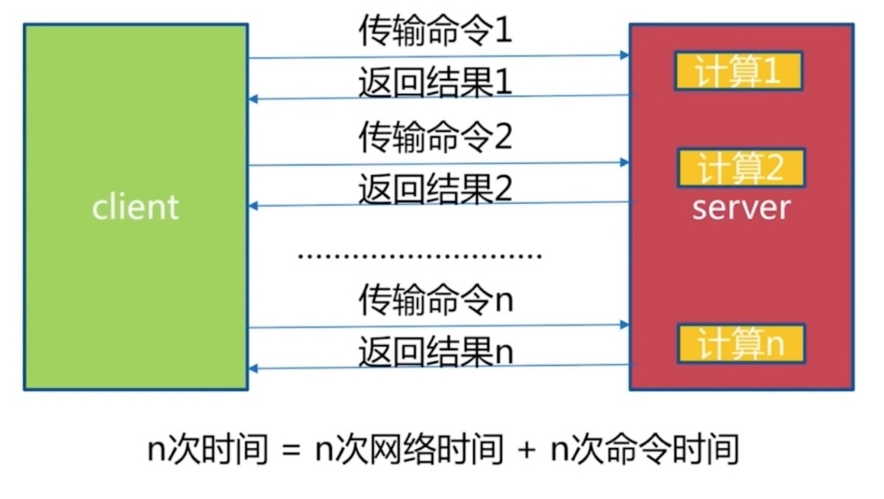

网络时间有变化

### 什么是流水线

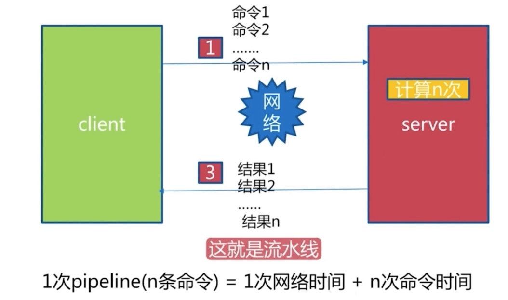

 
### 流水线的作用

| 命令 ｜ N个命令操作 | 1次 pipeline(n个命令) ｜
｜ -- ｜ -- ｜ -- ｜
｜ 时间 ｜ n次网络+n次命令 ｜ 1次网络 + n次命令 ｜
｜ 数据量 ｜ 1条命令 ｜ n条命令 ｜

1. redis 的命令时间是微妙级别
2. pipeline 每次条数要控制（网络）

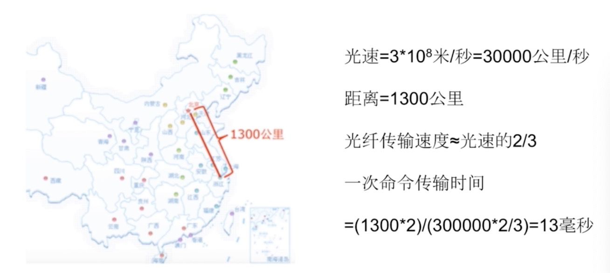

没有命令执行时间，只有传输时间

### 客户端实现

```java
Jedis jedis = new Jedis("127.0.0.1", 6379);
for (int i=0; i<10000; i++) {
  jedis.hset("hashkey:" + i, "field" + i, "value" + i);
}
```
1w hset => 50s

```java
Jedis jedis = new Jedis("127.0.0.1", 6379);
for (int i=0; i<100; i++) {
  Pipeline pipeline = jedis.pipelined();
  for (int j=i*100; j<(i+1)*100; j++) {
    pipeline.hset("hashkey:" + j, "field" + j, "value" + j);	  
  } 
  pipeline.syncAndReturnAll();
}
```
1w hset => 0.7s

### 与原生操作对比

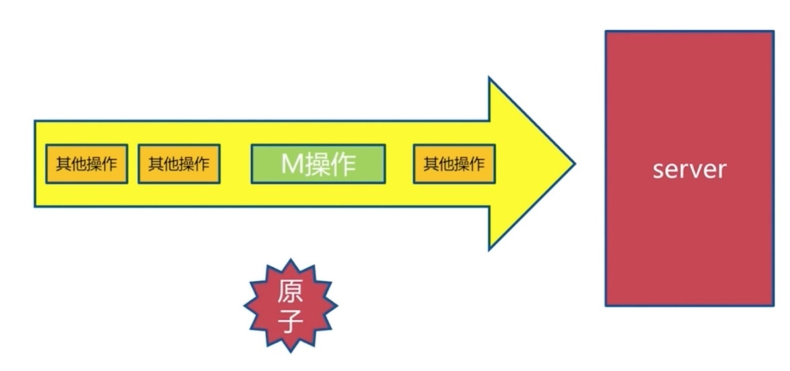

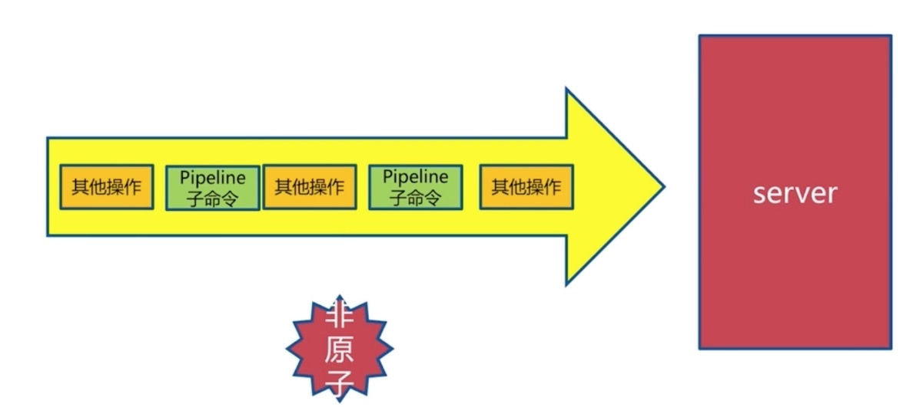

返回时按照顺序读取

### 使用建议

1. 注意每次pipeline携带数据量
2. pipeline 每次只能作用在一个 Redis 节点上
3. M操作与pipeline区别

## 发布订阅

### 角色

- 发布者(publisher)
- 订阅着(subscriber)
- 频道(channel)

### 通信模型

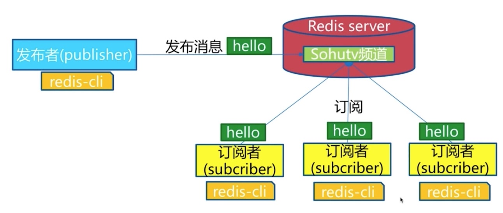

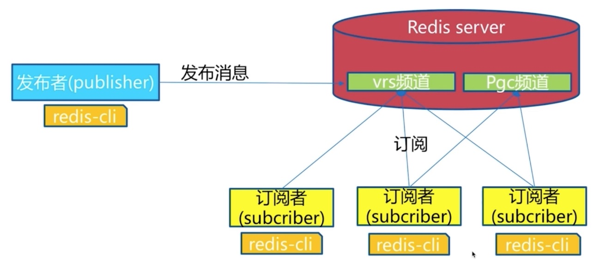

### API

- publish(发布命令)
- subscribe
- unsubscribe
- 其他

#### publish(发布命令)

`API: publish cahnnel message`

```
redis> publish sohu:tv "hello world"
(integer) 3 #订阅着个数

redis> publish sohu:auto "taxi"
(integer)
```

#### subcribe(订阅)

`API: subscribe [channel] #一个或多个`

```
redis> subscribe sohu:tv
1) "subscribe"
2) "sohu:tv"
3) "(integer) 1"
1) "message"
2) "sohu:tv"
3) "hello world"
```

#### unsubcribe(取消订阅)

`API: unsubscribe [channel] #一个或多个`

```
redis> unsubscribe sohu:tv
1) "unsubscribe"
2) "sohu:tv"
3) (integer) 0
```

#### 其他 API

```
psubscribe [pattern...] #订阅模式
punsubscribe [pattern...] #退订指定的模式
pubsub channels #列出至少有一个订阅者的频道
pubsub numsub [cahnel...] #列出给定频道的订阅者数量
```

### 发布订阅与消息队列


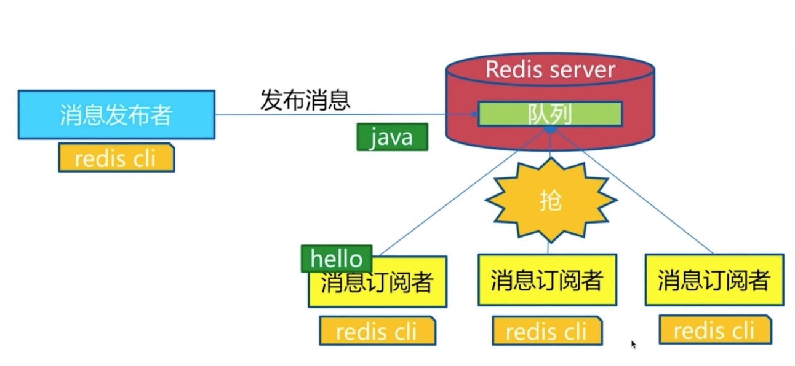


1. 发布订阅模式中的角色
2. 重要的 API
3. 消息队列和发布订阅

## 持久化

> 所有数据保存在内存中，对数据的更新将异步保存到磁盘上

### 持久化实现方式

- 快照
  - MySQL: dump
  - Redis: RDB
- 写日志
  - MySQL: binlog
  - Hbase: Hlog
  - Redis: AOF


#### RDB

[RDB](./imgs/rdb.jpg)

Redis是把数据保存内容当中，RDB文件通过一条命令将Redis内存中的数据完整的生成一个快照保存到硬盘当中。文件格式是二进制的RDB文件保存在硬盘中。当从硬盘恢复到Redis的时候，Redis服务重启时，启动加载某时某刻的RDB文件到Redis当中。


#### 触发机制方式

- save(同步)
- bgsave(异步)
- 自动


- save

[save 同步命令](./imgs/rdb1.jpg)

```
redis> save
OK
```

大数据量时阻塞，单线程

[save 同步命令](./imgs/rdb2.jpg)


文件策略 -> 存在老的RDB文件，新替换老

复杂度 -> O(N)

- [bgsave](./img/rdb3.jpg)

客户端执行bgsave，在主进程执行fork()函数生成redis子进程完成生成RDB文件，RDB文件生成之后告诉主进程RDB文件生成成功了。之后 create RDB开始执行。fork()是很快的，但有可能极少情况下阻塞。此时正常响应客户端。
```
redis> bgsave
Background saving started
```

#### save 与 bgsave

| 命令 ｜ save | bgsave |
| --- | --- | --- |
| IO类型 ｜ 同步 | 异步 |
| 阻塞？ ｜ 是 | 是（阻塞发生在fork） |
| 复杂度 ｜ O(n) | O(n) |
| 优点 ｜ 不会消耗额外内存 | 不阻塞客户端命令 |
| 缺点 ｜ 阻塞客户端命令 | 需要fork,消耗内存 |
